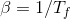
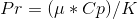
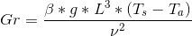
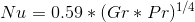
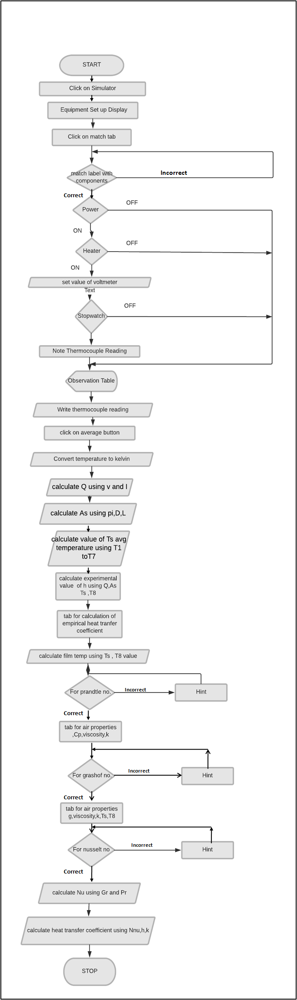
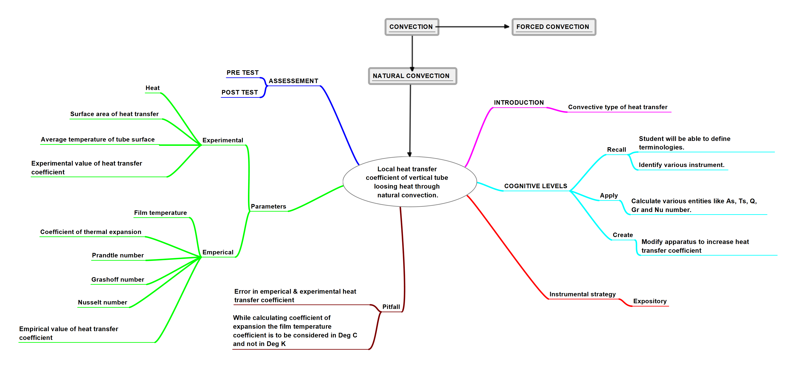

## Round 2

Experiment: To determine the local heat transfer coefficient for a vertical tube loosing heat by natural convection.

### 1. Story Outline:

Convection is the mode of heat transfer in which the heat is transferred by the actual movement of fluid molecules from one place to another. Convective type of heat transfer is always possible in case of presence of fluids like air, water etc. Convection takes place in two ways: Natural convection and Forced convection.  Natural convection phenomenon is due to the density gradient and no external force is used.   The set up is designed to find out the value of local heat transfer coefficient by experimentally and using empirical correlations.
The apparatus consists of a cartridge heater with brass tube fitted in a rectangular duct in a vertical position. The duct is open at top and bottom and forms an enclosure to serve the purpose of undisturbed surrounding. An electric heating element is kept in the vertical tube, which in turn heats the tube surface. The heat is lost from the tube to the surrounding air by natural convection. The temperature of the vertical tube is measured by seven thermocouples.  
Proper procedure is followed to run the experiment. Once the readings are taken, the students will enter the values of voltmeter, ammeter and temperature of the thermocouples in observation table and will start doing calculations. The calculations are done in two sections. By using the temperature data generated in simulator, the value for local heat transfer coefficient is calculated. By using empirical correlations between various dimensionless numbers like Prandtl number, Grashoff number and Nusselt number the empirical value of local heat transfer coefficient is calculated.

### 2. Story:

When a body is exposed in atmosphere, heat is transferred to the surrounding by natural convection. The layers of substance gets heated when it comes in contact with the hot body , rises up due to the decrease in its density and in the  bottom side the cold fluid gets rushed . The process is continuous and the heat transfer takes place due to relative motion of the hot and cold particles.
Natural Convection Apparatus consists of a metal cylindrical tube fitted vertically in a wooden rectangular duct which is open at the top and the bottom. An electric heater is provided in the vertical tube, which heats the surface of the tube. Heat is lost from the tube to the surrounding air by natural convection, because the air in contact with the cylinder gets heated and becomes less dense, causing it to rise. This in turn creates a continuous flow of air upward in the duct. The temperature at the various locations on the surface of the vertical tube and in the incoming and outgoing air is monitored with thermocouples. The duct is made of wood because it is a poor conductor, so not much heat will transfer from the air to the duct. Thus, the duct will enhance air flow without introducing another convective surface. 
 The simulator shows the actual process taking place during the heat transfer along with the calculation section. Students are supposed to go through the theory, procedure and pretest to understand the simulation and carryout the calculation part. In theory section, the basic heat transfer concepts, formulas, dimensionless numbers, etc are given. In pretest, the questionnaire is arranged to check the knowledge required to perform the practical as well as calculation part. In procedure, the steps are given to handle the simulator properly. In simulator, students have to follow the set of  instructions to start the experiment. Starting with switching on the power and heater switch. Hater will allow the heating of the brass tube present inside the wooden duct. Thermocouples present on the metal tube and inside the duct will indicate the temperature changes. The stopwatch is used to know the time for taking one set of iteration. After every time cycle of 3 minute the students will note down the readings till the steady state is achieved. As the steady state is achieved, the stopwatch, heater and power button will be switched off sequentially. In calculation section displayed below the simulator, first the observation table will be displayed where the students need to enter the values of voltmeter, ammeter and thermocouple readings for all sets of iterations till steady state. In first part, the experimental value of local heat transfer coefficient is calculated.
 By calculating Q,As and Ts value the experimental value of h is calculated. In next part, the empirical value of h is calculated by using various dimensionless numbers. Students first of all need to choose the correct formula for the calculation of Prandtl , Grashoff and Nusselt numbers. The values of the variables like k, ν, Cp, and μ is found from the Air property tab, which when clicked displays the air property table. The values of these parameters are considered at Tf calculated above. By using empirical correlations of these dimensionless numbers, the empirical value of  h is calculated. During these calculations, students are supposed to choose correct options for various dimensionless numbers to know their understanding about it.If the students fail to choose correct option, the alert message will be displayed about "the answer is wrong." The hints will be provided in these messages so that by using the hint the students should again try and choose correct answer to proceed with further calculations. If the options chosen by students are correct then the message will be displayed as "Answer is correct" so that they can proceed with further calculations.

 Objective of this experiment is to make students understand the way heat transfer taking place by the natural convection, with the help of virtual lab set up.

#### 2.1 Set the Visual Stage Description:
For visual betterment the first visual stage consists of image of the set up and the section at the left side of the page is consisting of aim, theory, apparatus, procedure, pretest, simulator, post test and references. By clicking on each of the subtitle students have to perform the activity mentioned in it and then promoted to the next subtitle. In this page, a image of experimental set up will be shown.  
 In Aim, the aim of the experiment should be displayed as “To determine the local heat transfer coefficient for a vertical tube loosing heat by natural convection.”  
In Theory, detailed theory relevant to experiment should be displayed explaining various terminologies related to convective heat transfer mode, types of instrumental components used in the experiment  where they will understand  details of the experiment . This will help them to perform pretest and post test activity.  
In Pretest tab, the students will be performing certain tasks based on previous knowledge pertaining to topic.   
In procedure the set of instructions are given regarding how to operate the simulator to run the experiment.   
Simulator will show the image of the entire set up with instrumental components like power supply, voltmeter, ammeter, thermocouple  temperature tab,  stopwatch, vertical brass tube containing the heater which is enclosed in a rectangular wooden duct  which is open at both the ends. 8 Thermocouples will be shown in the set up, out of which 7 will be located on the vertical brass tube and 1 suspended in duct to measure ambient temperature.  
Power button and heater are provided with button to start the power supply and heater input. Once the input is given voltmeter and ammeter will show the readings.  Stopwatch is used to set check time ranging till 3 min. Once it reaches 3, alert message will be displayed regarding time is over for that particular iteration. Students will again start the stopwatch for 3 min. simultaneously, students will note down the thermocouple temperatures by clicking on the drop down list. The process will be repeated till steady state is achieved. Then students will switch off the stop watch, heater and the power supply sequentially.  
Students will then move to calculation part. In calculations students will enter the values of the temperature, voltage and ammeter in the observation table. Students will calculate experimental and empirical value of heat transfer coefficient  by using different equations. For experimental calculation students need to find out parameters like heat input, surface area, average surface temperature and then heat transfer coefficient.  
For empirical calculations students need to find out various dimensionless numbers like Prandtl number, Grashoff number and Nusselt number by using the air property table which will be displayed in the simulator and will open once clicked. Students will take values of various parameters like viscosity, specific heat, thermal conductivity and kinematic viscosity and will find the values of dimensionless numbers. By using empirical correlation between these numbers students will find out the value of heat transfer coefficient.

#### 2.2 Set User Objectives & Goals:
Objective of this experiment is to make students understand the concept of convection and types of it. They will understand various terminologies like natural convection, heat transfer coefficient etc. The students will be able to understand concept of dimensionless numbers and various dimensionless numbers like Prandtl number, Grashoff number, Nusselt number etc. and their correlation to calculate heat transfer coefficient.
#### 2.3 Set the Pathway Activities:
Step 1: Open Simulator  
Step 2: The diagram of the equipment set up will be displayed. Numbers will be specified for the components in the diagram  
Step 3: Students will go to adjoining table and will have to enter the number of the component against its name.   
Step 4: If the students matches labels correctly, the message should reflect "Answer is correct" 
Step 5: If the students matches labels incorrectly, the message should reflect "Wrong answer!! Try again"  
Step 6: Students will go to Power tab. 
Step 7: Switch on Power button. 
Step 8: Switch on the Heater. 
Step 9: Student will enter value for power in INPUT tab and will click on calculate. 
Step 10: Voltmeter and ammeter reading will be displayed in the respective tabs. 
Step 11: Press the start button on stopwatch to start it. 
Step 12: Timer reaches to 3 min, Message will be displayed "You can stop stopwatch now". 
Step 13: Student need to start the stopwatch for next iteration of reading till steady state is achieved. 
Step 14: Click on drop down arrow and choose thermocouple number properly in thermocouple temperature tab to note the value of thermocouple 1 and note it down as T1. 
Step 15: press dropdown and choose T2 to note the value of thermocouple 2 and note it down as T2. 
Step 16:  press dropdown and choose T3 to note the value of thermocouple3 and note it down as T3. 
Step 17:  press dropdown and choose T4 to note the value of thermocouple 4 and note it down as T4. 
Step 18: press dropdown and choose T5 to note the value of thermocouple 5 and note it down as T5. 
Step 19: press dropdown and choose T6 to note the value of thermocouple 6 and note it down as T6. 
Step 20: press dropdown and choose T7 to note the value of thermocouple 7 and note it down as T7. 
Step 21: press dropdown and choose T8 to note the value of thermocouple 8 and note it down as T8. 
Step 22: Note down temperatures for all 8 thermocouples till steady state is achieved. 
Step 23: Switch off the Stop watch and Heater. 
Step 24: Switch off the power button. 
Step 25: Student have to scroll down to calculate. 
Step 26: Student have to enter all temperature readings and voltmeter and ammeter reading in the observation table. 
Step 27: Enter the average values of all the columns in the average row 
Step 28: Students will enter the average of average tempeartures T1 to T7  
Step 29: Scroll down for doing calculations of experimental value of heat transfer coefficient 
Step 30: Student will enter the value of V and I. 
Step 31: Student will calculate value of Q and will enter the value in calculation block 
Step 32: If the value is correct mathematically, the message will be displayed as "Answer is correct" 
Step 33: If the entered value is wrong mathematically, the message will be displayed as "Answer is incorrect. Try again." 
Step 34: Student will calculate value of As and will enter the value in calculation block  
Step 35: If the If the value is correct mathematically, the message will be displayed as "Answer is correct" 
Step 36: If the entered value is wrong mathematically, the message will be displayed as "Answer is incorrect. Try again." 
Step 37: Students will enter the value of average temperatures calculated above in observation table.  
Step 38: Using Q, Ts and As value students will calculate the experimental value of heat transfer coefficient and will enter the value in the text box. 
Step 39: Scroll down for doing calculations of empirical value of heat transfer coefficient 
Step 40: Students will calculate Film temperature value, Tf and will enter the value in the text box. 
Step 41: Students will find the coefficient of thermal expansion β using Tf value and will write the value in the text box.  
Step 42: Direct formula is not mentioned in the steps to calculate Pr, students need to choose correct option  
Step 43: If the student chooses correct option, the message will be displayed as "Answer is correct" 
Step 44: Students will get the properties of the μ, Cp and k of air by clicking on the air property tab. 
Step 45: From μ, Cp and k values of air students will calculate the value of Pr and will enter it in the text box. 
Step 46: If formula chosen is wrong, hint will be displayed that "Pr = Ratio of momentum diffusivity to thermal diffusivity". 
Step 47: Students will again try and choose correct option then step no. 43,44 and 45 will be executed  
Step 48: Direct formula is not mentioned in the steps to calculate Gr, students need to choose correct option  
Step 49: If the student chooses correct option, the message will be displayed as 'Answer is correct". 
Step 50: Students will get the value of the ν from air properties by clicking on the air property tab. 
Step 51: From ν value of air, and values of β, g, L, Ts & T8 students will calculate the value of Gr and will enter the value in the text box. 
Step 52: Step No 49,50 and 51 will be executed. 
Step 53: If formula chosen is wrong, hint will be displayed that "Gr = Ratio of the buoyancy to viscous force acting on a fluid." 
Step 54: Students will again try and choose correct option then step no. 50 & 51 will be executed 
Step 55: Direct formula is not mentioned in the steps to calculate Nu; students need to choose correct option 
Step 56: If the student chooses correct option, the message will be displayed as "Answer is correct". 
Step 57: From Gr & Pr values calculated above students will calculate the value of Nu and will enter in the text box.  
Step 58: If formula chosen is wrong, hint will be displayed that use the formula for Gr.Pr<10^9  
Step 59: Students will again try and choose correct option then step no. 56 & 57 will be executed till students get correct answer. 
Step 60: Formula for calculating h will be displayed as h = (Nu x K)/L 
Step 61: From Nu, k and L value students will calculate heat transfer coefficient value and will enter the value in text box. 
Step 62: Students will click on"Done" finally. Message will be displayed as"Congratulations, you had done it"

##### 2.4 Set Challenges and Questions/Complexity/Variations in Questions:

The students are doing some formative assessment task during simulator operation.
1. Students need to write correct number for the components against their names.
2. Students need to calculate the values of the various parameters and need to enter the values in the text boxes assigned.
2.  They need to choose proper formula for calculating Grashoff, Nusselt and Prandtl number without which they can not proceed with calculations.
##### 2.5 Allow pitfalls:
1. Students are supposed to switch on power first and then heater.
2. In experimental calculation of the h value, the temperature used should be used in kelvin.
3. In empirical calculations, the Coefficient of thermal expansion is having unit / K using Tf value which is calculated in deg C. So 273 should be added to Tf before calculating Coefficient of thermal expansion.

##### 2.6 Conclusion:
The heat transfer coefficient is having maximum value at the beginning because of just starting of the boundary layer and it decreases in upward direction due to thickening of the layer. Comparison of the heat transfer Coefficient values indicates that the empirical value is less than experimental value due to loss of heat by radiation which is present naturally in the set up and cant be avoided.

##### 2.7 Equations/formulas:
(http://latex.codecogs.com/eqneditor/samples/example3.php) </b>

1. Heat in put(supplied)heater (Q)  Q  = V * I
2. Area of heat transfer surface (As)        
3. Average temperature of tube surface Ts = (T1+T2+T3+T4+T5+T6+T7)/7
4. Heat transfer coefficient (h)= Q / (As* (Ts-T8))
5. Film temperature (Tf)   Tf = (Ts +T8)/2
6. Coefficient of thermal expansion  
7. Prandtle No  

8. Grashoff No (Gr) =   
9. Nusselt No.  

10. Local heat transfer Coefficient empirically = h =(Nu * k)/L

### 3. Flowchart 4
 

### 4. Mindmap:

### 5. Storyboard :
<a href="Storyboard/Storyboard Natural convection.gif">  [Here]</a>
