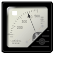
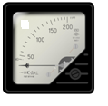
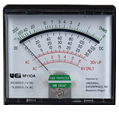

### Pretest
1.	Generally, natural convection occurs due to---  
a. change in velocity of a fluid  
b. change in density of a fluid  
c. change in molecular structure of a fluid  
d. none of the above  
Answer: b

2.	Conduction plus fluid flow in motion is known as---  
a) Radiation  
b) Conduction  
c) Convection  
d) Heat exchanger  
Answer: c  
Explanation: It is convection i.e. conduction plus some velocity. It is the process of energy transport affected by the mixing of a fluid medium.

3.	 Which of the following heat flow situations pertains to free or natural convection?  
a) Air conditioning installations and nuclear reactors  
b) Flow of water inside the condenser tubes  
c) Cooling of internal combustion engine  
d) Cooling of billets in atmosphere  
Answer: d  
Explanation: Cooling of billets in atmosphere is both free and natural convection.

4.	A body cooling from 80 degree Celsius to 70 degree Celsius takes 10 minutes when left exposed to environmental conditions. If the body is to cool further from 70 degree Celsius to 60 degree Celsius under the same external conditions, it will take--- 
a) Same time of 10 minutes  
b) More than 10 minutes  
c) Less than 10 minutes  
d) Time will depend upon the environmental conditions  
Answer: b  
Explanation: Q = h A (t b – t a). Apparently, the cooling depends upon the same temperature difference.

5.	Which number indicates the relative ability of the fluid to diffuse momentum and internal energy by molecular mechanisms?  
a) Nusselt number  
b) Prandtl number  
c) Peclet number  
d) Stanton number  
Answer: b
Explanation: It is the ratio of kinematic viscosity to thermal diffusivity of the fluid

6.	Which of the following is the image for the voltmeter?  
a) 	  	
b)  

  c)     
Answer: a

7.	The product of buoyant force and inertia force to the square of the viscous force is known as---  
a) Stanton number  
b) Grashof number  
c) Fourier number  
d) Peclet number  
Answer: b
Explanation: It indicates the relative strength of the buoyant to the viscous forces. It represents the ratio of the product of buoyant and inertia forces to the square of the viscous forces.
