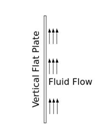

### Posttest
1.	1.	Figure given below shows a natural convection heat transfer on a vertical flat plate surrounded by a fluid.

What is the relation between the upward velocity of the fluid and the distance from the bottom of the plate, when plate is hotter that fluid?

a. as the distance from the bottom of the plate increases, the upward velocity of the fluid near the plate surface decreases 
b. as the distance from the bottom of the plate increases, the upward velocity of the fluid near the plate surface increases 
c. the upward velocity of the fluid near the plate surface is same all over the plate 
d. unpredictable  

Answer: b

2.	A finned tube hot water radiator with a fan blowing air over it is kept in rooms during winter. The major portion of the heat transfer from the radiation is due to ---- 
a) Combined conduction and radiation  
b) Radiation to the surroundings  
c) Better conduction  
d) Convection to the air  
Answer: d  
Explanation: Convection is a process in which thermal energy is transferred between solid and fluid flowing through it.

3.	Which number establishes the relation between convective film coefficient, thermal conductivity of the fluid and a significant length parameter? 
a) Nusselt number  
b) Stanton number  
c) Peclet number 
d) Fourier number 
Answer: a 
Explanation: The Nusselt number may be interpreted as the ratio of temperature gradient to an overall reference temperature gradient.

4.	Assume a natural convection heat transfer on a vertical flat plate surrounded by a fluid. Where will be the fully developed turbulent layer of fluid established, if the plate is hotter than the fluid?  

a. At the bottom of the plate  
b. At the middle of the plate  
c. At the top of the plate  
d. Nowhere  
Answer: c  

5.	The buoyancy forces which give rise to the natural convection are called as  
a. convection forces  
b. fluid forces  
c. body forces  
d. none of the above  
 Answer: c  

6. If the diameter of the pipe is increased , the heat transfer coefficient will -------- 
a.  Increase  
b.  decrease  
c.  remains same     
    Answer: b  

7. If the diameter of the pipe is decreased , the heat transfer coefficient will --------  
a.  Increase  
b.  decrease  
c.  remains same    
Answer: a

8. If the vertical assembly is replaced with horizontal assembly by keeping rest parameters same,  will the heat transfer coefficient will -----  
a.  increase 
b.  decrease 
c.  remains same 
Answer: b
